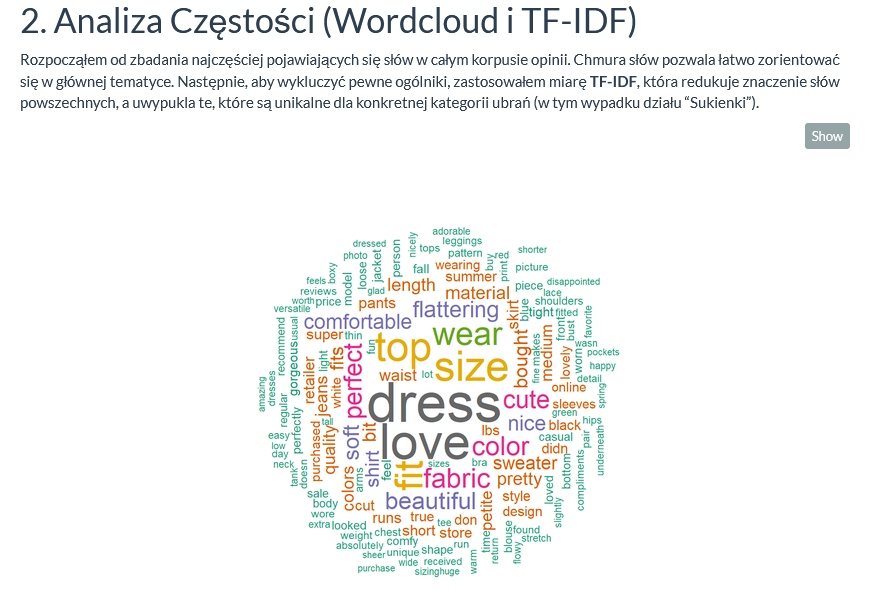
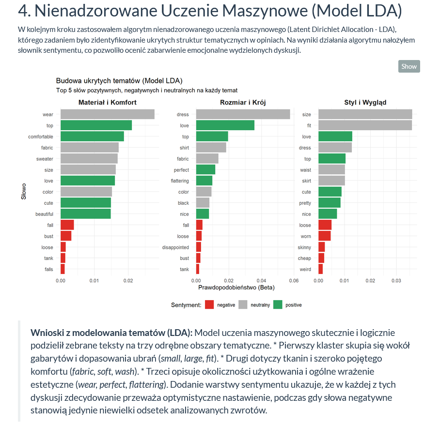
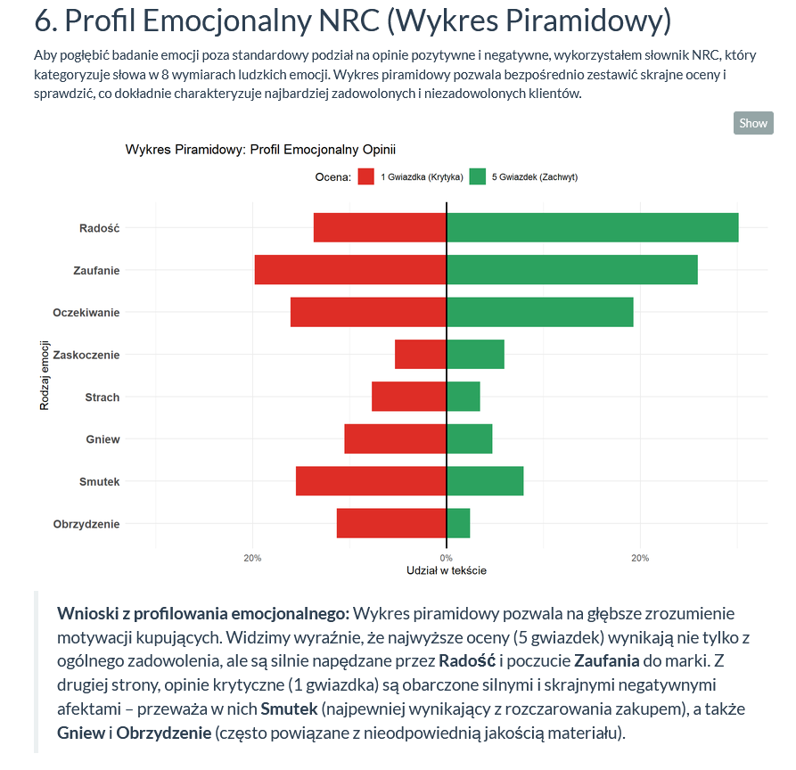
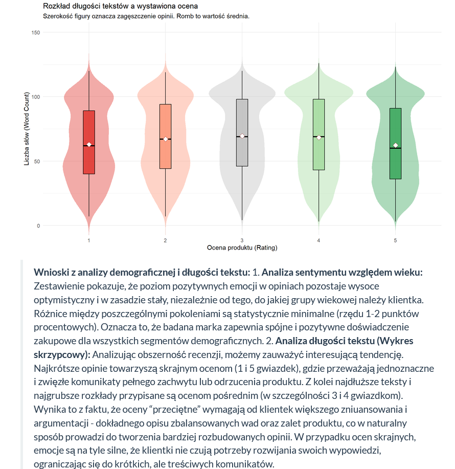

# r-ecommerce-nlp-sentiment-analysis
R-based Natural Language Processing (NLP) analysis of women's clothing e-commerce reviews, topic modeling, sentiment analysis, and the relationship between customer age, ratings, and emotional profile.

## Głos klientek w e-commerce – co kryje się za oceną w gwiazdkach?
Projekt analityczny wykonany w języku R, którego celem jest zbadanie nieustrukturyzowanych danych tekstowych (ponad 23 tysiące recenzji klientek sklepu odzieżowego) za pomocą technik Text Mining oraz uczenia maszynowego.

Analiza wykracza poza standardowe podsumowanie ocen. Bada prawdziwy ładunek emocjonalny recenzji, wykrywa najczęściej poruszane tematy ukryte w tekście oraz analizuje behawiorystykę klientek – od długości pisanych opinii po różnice demograficzne.

## Cel projektu
**Główne pytanie analityczne:**
Jakie ukryte wzorce tematyczne i emocjonalne można wyodrębnić z tekstowych recenzji klientek i jak korelują one z ostateczną oceną produktu oraz demografią?

**Dodatkowe pytania:**
* Które słowa i frazy (bigramy) najsilniej definiują poszczególne kategorie ubrań?
* Jakie są 3 główne obszary tematyczne (ukryte tematy), o których dyskutują klientki?
* Czy wiek klientek wpływa na to, czy piszą one bardziej pozytywne, czy negatywne opinie?
* Jaki jest dokładny profil psychologiczny (8 bazowych emocji wg słownika NRC) opinii 1-gwiazdkowych vs 5-gwiazdkowych?
* Czy osoby skrajnie niezadowolone piszą dłuższe recenzje niż te zachwycone produktem?

## Zakres analizy
Analiza opiera się na zbiorze danych *Womens Clothing E-Commerce Reviews*. Skupia się na połączeniu danych liczbowych i kategorialnych (Ocena 1-5, Wiek, Dział) z danymi tekstowymi (Tytuł i Treść opinii). 

Do badania sentymentu wykorzystano dwa zwalidowane leksykony badawcze:
* **Słownik Bing** (polaryzacja binarna: pozytywne / negatywne)
* **Słownik NRC** (profilowanie 8 emocji ludzkich: gniew, oczekiwanie, obrzydzenie, strach, radość, smutek, zaskoczenie, zaufanie)

## Główne obszary analizy i kod

### 1. Przetwarzanie Języka Naturalnego (NLP Preprocessing)
Surowy tekst nie nadaje się do analizy. Zastosowano tokenizację (rozbicie tekstu na pojedyncze słowa) oraz oczyszczenie danych z interpunkcji, cyfr i tzw. *stop-words* (słów bez znaczenia analitycznego).

```R
tokens <- df_clean %>%
  mutate(text = str_replace_all(text, "[^a-zA-Z\\s]", " ")) %>%
  unnest_tokens(word, text) %>%
  anti_join(stop_words, by = "word") %>%
  filter(str_length(word) > 2)
```

### 2. Znaczenie słów (TF-IDF)

Zamiast zwykłego zliczania słów, użyto algorytmu TF-IDF (Term Frequency-Inverse Document Frequency). Pozwala on na zignorowanie słów popularnych w całym sklepie (np. "sukienka", "rozmiar"), a uwypukla te, które są unikalne dla konkretnej kategorii odzieży.

### 3. Nienadzorowane Uczenie Maszynowe (Model LDA)

Wykorzystano algorytm Latent Dirichlet Allocation (LDA) do automatycznego pogrupowania tysięcy recenzji w 3 ukryte klastry tematyczne.

```R
dtm <- tokens %>%
  count(doc_id, word) %>%
  cast_dtm(doc_id, word, n)

lda_model <- LDA(dtm, k = 3, control = list(seed = 1234))
tematy <- tidy(lda_model, matrix = "beta")
```

Pozwoliło to zidentyfikować, że klientki rozmawiają głównie o

- Rozmiarze i Kroju
- Materiale i Komforcie
- Stylu i Wyglądzie

### 4. Profilowanie Emocjonalne (Leksykon NRC)

Słownik NRC pozwolił na głęboką dekonstrukcję ocen. Zamiast prostego "dobrze/źle", mierzono udział konkretnych emocji w tekstach przy użyciu inner_join ze słownikiem emocji.
Kluczowe obserwacje (Data Storytelling)

 Skrajności są zwięzłe (Analiza długości tekstu)
Analiza rozkładu (wykresy skrzypcowe) udowodniła, że najkrótsze opinie towarzyszą skrajnym ocenom (1 i 5 gwiazdek). Oceny pośrednie (3-4 gwiazdki) generują najdłuższe teksty – klientki ważą w nich zalety i wady, co wymaga dłuższego opisu. Zachwyt i odrzucenie są wyrażane zwięźle.

 Wiek a sentyment
Badanie wykazało, że wiek klientek nie ma istotnego wpływu na ładunek emocjonalny ich opinii. Proporcja używanych słów pozytywnych do negatywnych pozostaje stabilna we wszystkich przedziałach wiekowych (ok. 77-78% słów pozytywnych). Marka zapewnia spójne doświadczenie niezależnie od pokolenia.

 Anatomia 1 gwiazdki
Wykres piramidowy emocji wykazał, że opinie 5-gwiazdkowe są napędzane "Radością" i "Zaufaniem". Z kolei recenzje 1-gwiazdkowe to nie tylko "Smutek" (rozczarowanie), ale w bardzo dużej mierze "Gniew" i "Obrzydzenie" – emocje silnie korelujące ze słabą jakością użytych materiałów.
UX / Wizualizacja (Data Storytelling w R)

Zamiast suchych tabel, do raportowania wyników wykorzystano zaawansowane pakiety graficzne w R (ggplot2, ggraph, wordcloud).

Zastosowano

- Diverging Bar Chart (Wykres piramidowy) do ostrego kontrastowania emocji w ocenach 1 vs 5.
- Wykresy Sieciowe (Network Graphs) do pokazania powiązań między słowami (Bigramy).
- Wykresy Skrzypcowe (Violin Plots) połączone z Boxplotami do pokazania zagęszczenia długości tekstów.
- Znormalizowaną paletę kolorów (zielony dla pozytywów, czerwony dla negatywów), aby ułatwić szybkie czytanie wykresów przez biznes.

## Technologie

- Język: R
- Przetwarzanie danych: tidyverse, dplyr, reshape2
- NLP & Text Mining: tidytext, tm, textdata
- Machine Learning: topicmodels (LDA)
- Data Visualization: ggplot2, igraph, ggraph, wordcloud
- Raportowanie: R Markdown (HTML)

## Umiejętności zaprezentowane w projekcie

Projekt pokazuje praktyczne wykorzystanie

- Czyszczenia i transformacji danych tekstowych (RegEx, Tokenizacja).
- Wdrażania modeli nienadzorowanego uczenia maszynowego (Topic Modeling).
- Analizy sentymentu opartej na leksykonach.
- Zaawansowanej wizualizacji danych.
- Interpretacji wyników matematycznych na język korzyści biznesowych.

## Struktura repozytorium

```text
r-ecommerce-nlp-sentiment-analysis/
├── README.md
├── Projekt tekst mining.R
├── Projekt tekst mining.Rmd
├── Projekt-tekst-mining.html
├── data/
│   └── sample_reviews.csv
└── images/
    ├── 01_chmura_slow.png
    ├── 02_siec_bigramow.png
    ├── 03_lda_tematy.png
    ├── 04_bing_sentyment.png
    ├── 05_nrc_piramida.png
    ├── 06_wiek_vs_sentyment.png
    └── 07_dlugosc_ocena.png
```

## Wybrane wizualizacje z projektu

**1. Najczęściej występujące słowa (Wordcloud)**  


**2. Wykrywanie ukrytych tematów (Algorytm LDA)**  


**3. Profil Emocjonalny Opinii (Wykres Piramidowy - NRC)**  


**4. Długość tekstu a wystawiona ocena**  


## Cel projektu

Projekt został stworzony jako element portfolio analitycznego w celu zaprezentowania zaawansowanych umiejętności w zakresie analizy języka naturalnego (NLP) i statystyki w języku R. Najważniejszym elementem jest udowodnienie, że dane tekstowe można skwantyfikować i wykorzystać do wyciągania twardych wniosków biznesowych.

**Mateusz**  
*Aspiring Data Analyst | Power BI | SQL | Python | Excel | R*
